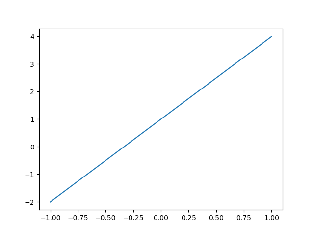
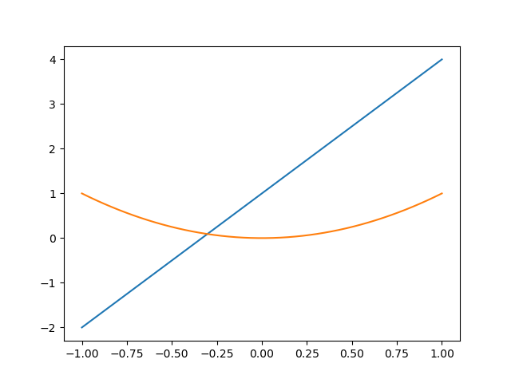
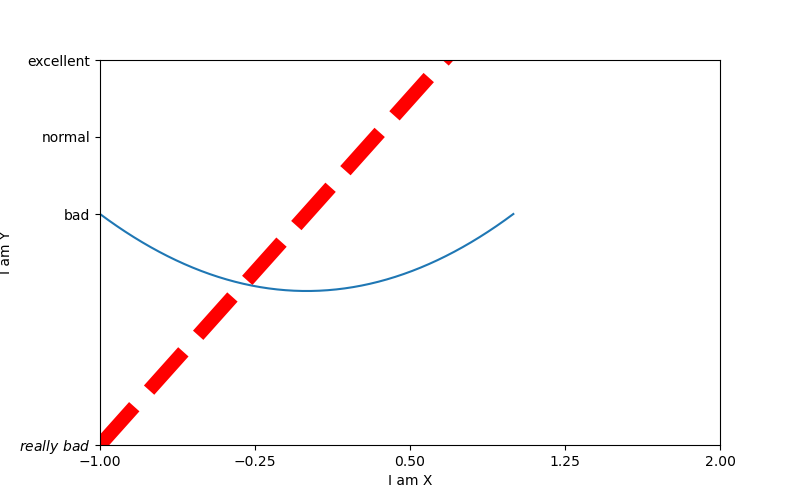
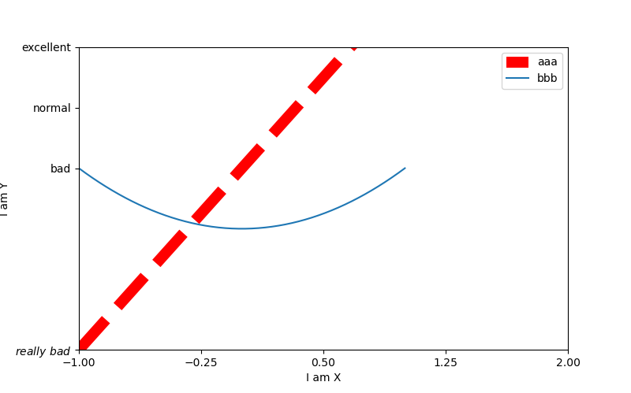
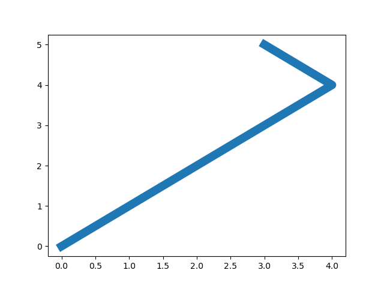
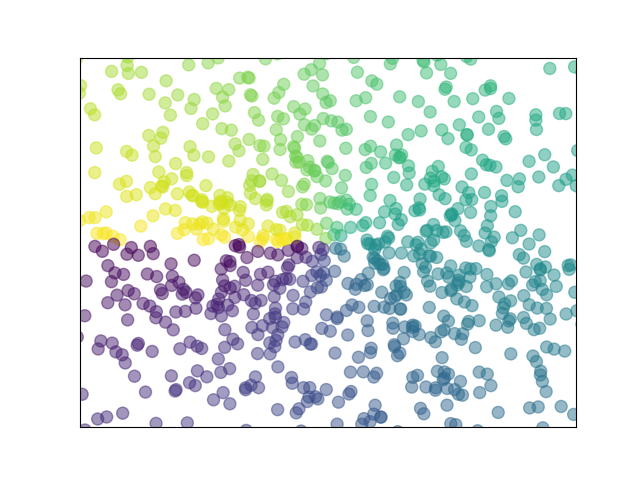
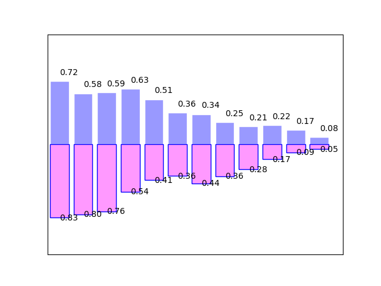
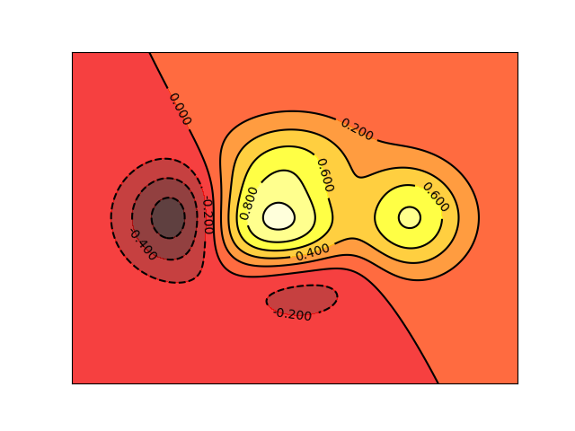
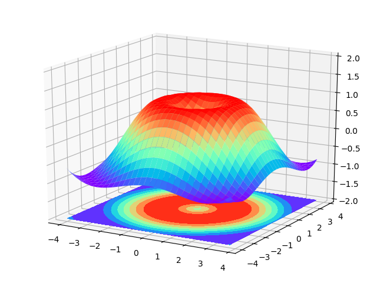
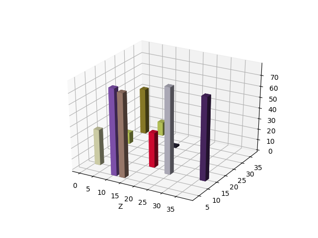

##                                           sMatplotlib

[matplotlib中文官方网页](https://www.matplotlib.org.cn/tutorials/introductory/sample_plots.html#line-plot)   


 

#### 安装好matplotlib之后执行作图脚本报错信息显示没有Tkinter模块  ？

#####        Tkinter模块是python内置模块，用来和用户图形界面交互的包。解决办法是找到python的setup安装包，双击后点击modify,将未勾选的tcl/tk and IDLE勾选即可


#### test01

```python
import matplotlib.pyplot as plt
import numpy as np
x = np.linspace(-1, 1, 50)
y = 3 * x + 1   # [1]
plt.plot(x, y)
plt.show()

# x取值范围为-1至1，一共取50个点 
# 对于ndarry数据，可以直接与数字之间进行数学运算,如果[1]处是list，则此脚本会出问题
# 显示图片需要show函数
```




```python
import matplotlib.pyplot as plt
import numpy as np
x = np.linspace(-1, 1, 50)
print(x)
y1 = 3 * x + 1
y2 = x ** 2
plt.plot(x, y1)
plt.plot(x, y2)
plt.show()

# 这里将只出现一张图片（如下图所示），如果将脚本改为：
import matplotlib.pyplot as plt
import numpy as np
x = np.linspace(-1, 1, 50)
print(x)
y1 = 3 * x + 1
y2 = x ** 2
plt.figure()   # [2]
plt.plot(x, y1) # [3]
plt.figure()
plt.plot(x, y2)
plt.show()
# 此时将出现两张图   plt.figure()会将其下的plot函数放入自己的图片中，直至遇到下一个plt.figure()
# 由于没有加参数，两张图默认分别命名为Figure1和Figure2.

# 将[2][3]改为：
plt.figure(num=3,figsize=(8,5))
# 两张图名分别为Figure3 Figure4 ，Figure3长8高5
plt.plot(x, y1,color= "red",linewidth=10.0,linestyle="--")
# 设置线为红色，宽度为10.0，线形为"--" 
```




```python
import matplotlib.pyplot as plt
import numpy as np
x = np.linspace(-1, 1, 50)
print(x)
y1 = 3 * x + 1
y2 = x ** 2
plt.figure(num=3,figsize=(8,5))
plt.plot(x, y1,color= "red",linewidth=10.0,linestyle="--")
plt.plot(x, y2)
plt.xlabel("I am X")  # 设置x轴名称
plt.ylabel("I am Y")  # 设置y轴名称
plt.xlim((-1,2))      # 设置x轴范围
plt.ylim((-2,3))      # 设置y轴范围
new_ticks = np.linspace(-1,2,5) 
plt.xticks(new_ticks) # 设置x轴的角标，将 -1~2 分割成50等分
plt.yticks([-2,1,2,3],[r"$really\ bad$","bad","normal","excellent"])
# 设置y轴角标，对应位置分别写上对应的注释  其中r"$really\ bad$"是为了改变字体，关于改变字体以及具体
# 的转义网上有专门的讲解，这里不作叙述
plt.show()

#运行结果如下图 
```



```python
# 改变坐标轴的位置，比如让x轴和y=5对齐，需要用到plt.gca   略	
```


```python
import matplotlib.pyplot as plt
import numpy as np
x = np.linspace(-1, 1, 50)
print(x)
y1 = 3 * x + 1
y2 = x ** 2
plt.figure(num=3,figsize=(8,5))
# [1] plt.plot(x, y1,color= "red",linewidth=10.0,linestyle="--",label="up") 
# [2] plt.plot(x, y2,label="down")
# plt.legend()
l1, = plt.plot(x, y1,color= "red",linewidth=10.0,linestyle="--",label="up") # [3]
l2, = plt.plot(x, y2,label="down")                                           # [4]
plt.legend(handles = [l1,l2,],labels=["aaa","bbb",],loc="best")                # [5]

plt.xlabel("I am X")
plt.ylabel("I am Y")
plt.xlim((-1,2))
plt.ylim((-2,3))
new_ticks = np.linspace(-1,2,5)
plt.xticks(new_ticks)
plt.yticks([-2,1,2,3],[r"$really\ bad$","bad","normal","excellent"])
plt.show()

# 在[1],[2]两处的plot函数中加上label标签后执行plt.legend()就可以生成图例
# 按照[3]~[5]处的写法会把l1,l2中的label覆盖掉，改用aaa,bbb作为图例名称
# 如果[5]处写的是plt.legend(handles = [l1,],labels=["aaa",],loc="best")则图例中只出现aaa

# 运行结果如下图
```




```python
# 关于Annotaion 其主要用于对图片做各种标注    暂略
```

##### 插入：

```python
import matplotlib.pyplot as plt
import numpy as np
x = np.linspace(-1, 1, 50)
print(len(x))
y = 3 * x + 1
plt.plot(x, y)
plt.show()
```



##### 散点图

```python
import matplotlib.pyplot as plt
import numpy as np

n = 1024
x = np.random.normal(0,1,n)  # 平均值，方差，数量
y = np.random.normal(0,1,n)  # 平均值，方差，数量
t = np.arctan2(y,x) # [1]
plt.scatter(x,y,s=75,alpha=0.5,c=t)  # [2]
plt.xlim((-1.5,1.5))
plt.ylim((-1.5,1.5))
plt.xticks(())  # [3]
plt.yticks(())  # [4]
plt.show()

# 可以将[1]处省略并且将[2]处c=t去除，它们只是为了设置格式好看的
# [2]处s是设置点的size, alpha是设置点的透明度
# [3] [4]处设置角标为空，即不显示角标

# 效果图如下
```



##### 柱状图

```python
import matplotlib.pyplot as plt
import numpy as np

n = 12
x =np.arange(n)
y1 = (1 - x / float(n)) * np.random.uniform(0.5, 1.0, n) # [1]
y2 = (1 - x / float(n)) * np.random.uniform(0.5, 1.0, n)
plt.bar(x, +y1, facecolor="#9999ff", edgecolor = "white")  # [3]
plt.bar(x, -y2, facecolor="#ff99ff", edgecolor = "blue")
for a, b in zip(x, y1):    # [4]
   plt.text(a + 0.4, b + 0.05, "%.2f" % b, ha="center", va="bottom")

for a, b in zip(x, y2):
    plt.text(a + 0.4, - b - 0.05, "%.2f" % b, ha="center", va="bottom")

plt.xlim(-.5, n)
plt.xticks(())
plt.ylim(-1.25, 1.25)
plt.yticks(())
plt.show()

# [1]处 uniform(0.5, 1.0, n)是指在0.5~1.0中均匀插入n个点
# [2]处两个ndarray型数据相乘结果还是相同长度的ndarray数组
# [3]处facecolor是设置柱形图颜色，edgecolor是设置柱子边的颜色
# [4]处是设置在图中哪些位置显示什么文本 ha是水平方向排列 va是竖直方向排列
# zip在python的作用是将参数打包成元组

# 图如下
```


#####  

##### 等高线图

```python
import matplotlib.pyplot as plt
import numpy as np

# 显然 等高线图需要是一个三元函数   
def f(x,y):
    # the height function
    return (1 - x / 2 + x**5 + y**3) * np.exp(-x**2 -y**2)

n = 256
x = np.linspace(-3, 3, n)
y = np.linspace(-3, 3, n)
X,Y = np.meshgrid(x, y)       # 定义完x, y之后将其meshgrid作为等高线的自变量(仔细想一下meshgrid
# 是做什么的)
# use plt.contourf to filling contours
# X, Y and value for (X,Y) point

plt.contourf(X, Y, f(X, Y), 8, alpha=.75, cmap=plt.cm.hot)
# 8将区域划分为10块   （n+1条线  n+2块区域）
# use plt.contour to add contour lines
# cmap=plt.cm.hot是设置colormap，热色调

C = plt.contour(X, Y, f(X, Y), 8, colors='black', linewidth=.5)
plt.clabel(C, inline=True, fontsize=10)
# adding label  给9这条线加上数字描述

plt.xticks(())

plt.yticks(())

plt.show()
```



##### Image图片略


##### 3D图像

```python
# View more python tutorials on my Youtube and Youku channel!!!


# Youtube video tutorial: https://www.youtube.com/channel/UCdyjiB5H8Pu7aDTNVXTTpcg

# Youku video tutorial: http://i.youku.com/pythontutorial


# 14 - 3d

"""

Please note, this script is for python3+.

If you are using python2+, please modify it accordingly.

Tutorial reference:

http://www.python-course.eu/matplotlib_multiple_figures.php

"""


import numpy as np

import matplotlib.pyplot as plt

from mpl_toolkits.mplot3d import Axes3D
# mpl_toolkits.mplot3d是和matplotlib捆绑下载的


fig = plt.figure()

ax = Axes3D(fig)

# X, Y value

X = np.arange(-4, 4, 0.25)

Y = np.arange(-4, 4, 0.25)

X, Y = np.meshgrid(X, Y) # 三维图也需要meshgrid

R = np.sqrt(X ** 2 + Y ** 2)

# height value

Z = np.sin(R)


ax.plot_surface(X, Y, Z, rstride=1, cstride=1, cmap=plt.get_cmap('rainbow'))
# rstride和cstride分别是设置经度线和纬度线的密集程度，cmap有很多种设置方式，这里也是其中一种

"""

============= ================================================

        Argument      Description

        ============= ================================================

        *X*, *Y*, *Z* Data values as 2D arrays

        *rstride*     Array row stride (step size), defaults to 10

        *cstride*     Array column stride (step size), defaults to 10

        *color*       Color of the surface patches

        *cmap*        A colormap for the surface patches.

        *facecolors*  Face colors for the individual patches

        *norm*        An instance of Normalize to map values to colors

        *vmin*        Minimum value to map

        *vmax*        Maximum value to map

        *shade*       Whether to shade the facecolors

        ============= ================================================

"""


# I think this is different from plt12_contours

ax.contourf(X, Y, Z, zdir='z', offset=-2, cmap=plt.get_cmap('rainbow'))
# zdir和offset是设置压缩的等高线图在哪个轴的什么位置
# 这里是设置在z轴的-2位置
"""

==========  ================================================

        Argument    Description

        ==========  ================================================

        *X*, *Y*,   Data values as numpy.arrays

        *Z*

        *zdir*      The direction to use: x, y or z (default)

        *offset*    If specified plot a projection of the filled contour

                    on this position in plane normal to zdir

        ==========  ================================================

"""

ax.set_zlim(-2, 2)
#设置Z轴的范围

plt.show()

# 图如下
```

 

##### 注意这里是3D图，不能加colorbar, 二维等图有可能可以加colorbar。


##### 柱状图

```python
import numpy as np
import mpl_toolkits.mplot3d
import matplotlib.pyplot as plt
x=np.random.randint(0,40,10)
y=np.random.randint(0,40,10)
z=80*abs(np.sin(x+y))
ax=plt.subplot(projection='3d') # 这句话得写
for xx,yy,zz in zip(x,y,z):
    color=np.random.random(3)
    ax.bar3d(xx,yy,0,dx=2,dy=2,dz=zz,color=color)
    # xx,yy,zz是x,y,z方向的值  0是所有柱状图从纵坐标为0开始显示 dx dy是柱子的长度和宽度
#ax.set_xlabel('X')
#ax.set_xlabel('Y')
ax.set_xlabel('Z')
plt.show()
```

  