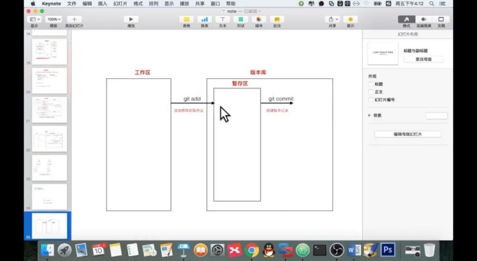
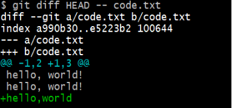
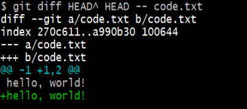
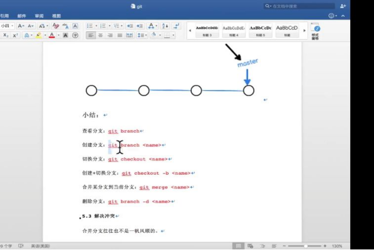
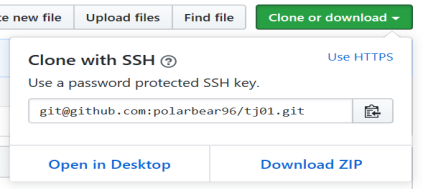
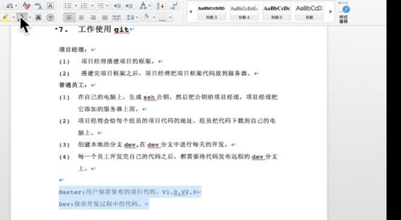

#                         **12-关于git和github** 

### **创建一个版本库：**

创建文件夹之后用 `git init` 命令创建一个空仓库，之后git会借助这个空仓库来管理这个目录下的代码，` git add code.txt` 将工作提交到暂存区，` git commit -m`  +“说明信息”  来 提交版本.  `git log`可以查看创建日志    (先登录，再操作)  *** 注意-m只是说明信息，两次提交的版本说明信息可以相同，但是最后提交的版本序列号是肯定不同的.**

### **版本回退与撤销回退**：

`git reset --hard HEAD^ `退回到上一级版本(`HEAD^^`是上上一级版本依此类推， 也可以用`HEAD~2`表示法，代表上上一个版本)

想撤销回退，e.g. 撤销版本2到1的回退，若知道版本2的序列号仍然可通过：`git reset --hard` 序列号实现  此外，`git reflog`可以查看之前的操作信息，其中也包含序列号信息，此命令也可以用于撤销版本回退

### **暂存区**

工作区有一个隐藏目录 .git, 这个不属于工作区，而是git的版本库，里面存了很多东西，其中最重要的就是称为stage(或称index)的暂存区 ，git add是添加修改到暂存区，`git commit`是创建版本记录  可以add多次之后一次性commit: ` git add code1.txt code2.txt`  \+ `git commit -m"..."` 将缓存区的所有修改提交到当前分支(code1.txt和code2.txt将被同时提交)。 如下图：

 

 

### 撤销工作区的改动 ：

 `git checkout -- file`  如果此时暂存区有文件，那么将会把工作区的文件退回到和暂存区相同，继续执行此命令会使工作区文件退回到和版本库中相同(前提是版本库中有这个文件的版本) , 换言之此命令会撤销工作区的修改使其与暂存区的对应文件相同，若暂存区没有此文件，则使其与版本库的该文件相同 (**这里的“--”没必要加，效果没区别)

### 撤销暂存区的改动：

`git reset HEAD file`   将暂存区的修改撤销掉(就是暂存区的文件拿回到工作区)，重新放回工作区 ，之后再用`git checkout -- file` 将其彻底还原.

### 对比文件的不同：

1.对比工作区和版本库中的文件(top)   2对比两个版本中的文件(bottom)

 

 

**删除文件**： 可以通过之前提到的撤销工作区的改动来实现对删除文件的恢复。

**新建一个文件但未add,那么删除此文件将无法恢复，因为没有添加到缓存区经历的file仓库不会跟踪**

 

### 关于分支：

   上述的HEAD实际上指向master(主分支)，master指向提交的版本。每次提交，master分支都会变长。

当我们创建新的分支，例如dev时，git新建了一个指针叫dev, 指向master相同的提交，再把HEAD指向dev,就表示当前分支在dev上 (**同一个文件在不同分支中当然可以不相同**)

 

关于分支的命令见下图：**`git branch`**  (查看分支)  **`git branch`** 分支名(新建分支)

**`git checkout`** 分支名(切换分支)  **`git checkout -b`** 分支名(新建分支并切换到此分支)

**`git merge`** 分支名(合并分支)  **`git branch -d`** 分支名(删除分支)

 

Plus: **`git log --pretty=oneline`可以将log精简显示，`git log --graph --pretty=oneline` 可以显示出分支图.**

 

 

 

 

**在两个分支上都有新的提交并且编辑的时同一个文件那么merge的时候会起冲突而失败，需要手动解决后再add,commit.**  

### 02-github分支管理/03-git分支管理策略未看，暂时不看意义不大

### Github的使用

，git clone 项目地址，

### 将项目克隆到本地，若克隆失败添加以下两个命令后载克隆.

（1）eval      “$ssh-aqent  -s”  （2）ssh-add

项目地址指的是：

(注意不要选Use HTTPS)

### 远程推送git push origin 本地分支名)

### 

e.g:

   

创建一个本地分支march并切换到它，之后远程push到github

（效果）

 

** 这是在之前的clone的基础上操作的，操作的是clone下的文件夹，否则这里的origin将无法使用，需先定义origin是什么：e.g: 

这里切换到别的文件夹，仍想上传skt1分支到之前的仓库，需要向截图中一样指定origin指代的仓库，之后再push.

 

### 拉取代码

**git pull origin 分支名**   将远程分支上的代码下载并合并到本地所在分支，和push类似

### 跟踪远程分支

**`git branch --set-upstream-to=origin/本地分支名 远程分支名`** 让本地分支跟踪远程分支

***工作中git的运用(了解一下)：

 

----

###                                                                                                                 OVER